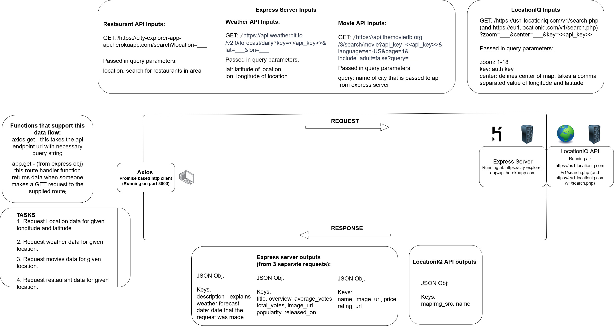

# City Explorer 
### Netlify link: This app can be found [here](https://nervous-mclean-43f026.netlify.app/)

**Author**: Alexander Beers
**Version**: 1.0.2

## Overview

This application outputs various details on a location that a user enters in the search bar such as longitude, latitude, and a detailed map.

## Getting Started

Clone repo and install necessary packages+dependencies by running 'npm i' command. Run 'npm start' command and open up application in browser at 'localhost:3000'. Must have valid API key from LocationIQ to run.

## Architecture

Axios, [LocationIQ API](https://locationiq.com/), React

## Change Log

01-01-2001 2:40pm - App can now successfully call API and extract lat, long, and name data on entered location. Basic Component layout finished.
01-01-2001 3:25pm - App now outputs the appropriate error message for failed API calls.
01-01-2001 6:15pm - App now displays a map along with the name and coordinate data. React Bootstrap components and styling were added.

## Credit and Collaborations

Ryan Emmans: Helped with data flow diagram and LocationIQ api use planning

### Name of feature: Locations - Allow user to enter the name of a location so that they can see the exact latitude and longitude of that location

Estimate of time needed to complete: 30m

Start time: 2:40

Finish time: 3:20

Actual time needed to complete: 40m

### Name of feature: Errors - Allow user to see clear messages if something goes wrong so that they know if I need to make any changes or try again in a different manner

Estimate of time needed to complete: 15m

Start time: 3:25

Finish time: 3:42

Actual time needed to complete: 17m

### Name of feature: Map - Allow the user to see a map of the city so that they can see the layout of the area and style app

Estimate of time needed to complete: 30m

Start time: 4:05

Finish time: 6:15

Actual time needed to complete: 2hrs 10m
